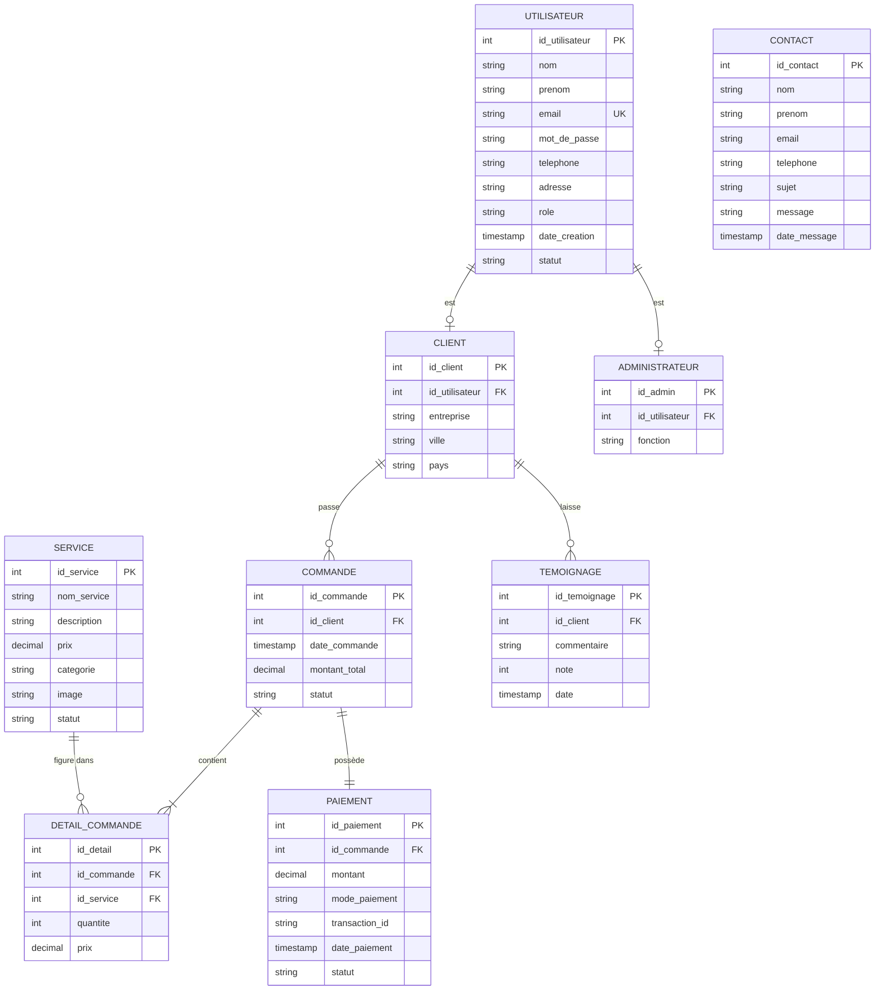

# Diagramme entité-association (ERD)

Diagramme au format Mermaid. Il s'affiche directement sur GitHub et dans la plupart
des éditeurs Markdown.

> Note : la table `CONTACT` n'a aucune relation directe : elle enregistre les messages
> envoyés depuis le formulaire de contact, y compris par des visiteurs non inscrits.
